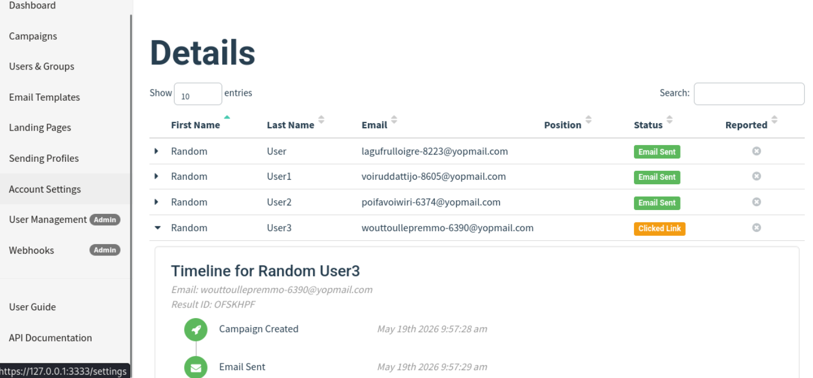
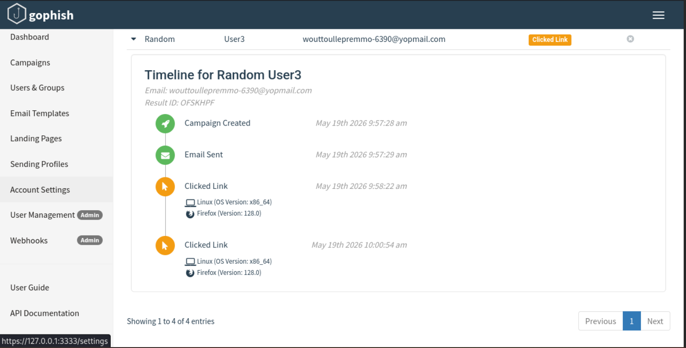

# Simulation de campagne phishing — GoPhish

> Exercice de formation — cadre pédagogique autorisé — 19/05/2026

---

## Contexte

En complément de l'analyse d'emails suspects, cet exercice consistait à simuler
une campagne phishing avec **GoPhish**, un outil open-source utilisé en entreprise
pour les tests de sensibilisation autorisés.

L'objectif n'est pas d'attaquer mais de comprendre les mécanismes de suivi côté attaquant —
un prérequis pour mieux les détecter côté défense.

| Élément | Détail |
|---|---|
| Outil | GoPhish (instance locale — 127.0.0.1:3333) |
| Cibles | 4 utilisateurs fictifs avec adresses @yopmail.com |
| Date | 19 mai 2026 — 9h57 |
| Environnement | Lab autorisé — aucune cible réelle |

---

## Déroulement de la campagne

### Envoi

La campagne a été créée et les 4 emails envoyés à 9h57:28.

| Utilisateur | Adresse | Statut |
|---|---|---|
| Random User | laguftulloigre-8223@yopmail.com | Email envoyé |
| Random User1 | voiruddattijo-8605@yopmail.com | Email envoyé |
| Random User2 | poifavoiwiri-6374@yopmail.com | Email envoyé |
| Random User3 | wouttoullepremmo-6390@yopmail.com | **Lien cliqué** |

### Résultat

1 utilisateur sur 4 a cliqué sur le lien — taux de clic : **25%**.

**Détail pour Random User3 :**
- Email reçu : 9h57:29
- Premier clic : 9h58:22 (54 secondes après réception)
- Deuxième clic : 10h00:54
- Navigateur : Firefox 128.0 — Linux x86_64

GoPhish enregistre pour chaque clic : l'heure, le navigateur, l'OS et l'identifiant de résultat.
Ces métadonnées permettent, dans un vrai test de sensibilisation, de cibler les utilisateurs
à former en priorité.

---

## Ce que ça montre côté Blue Team

### Côté attaquant (pour comprendre)

- GoPhish automatise l'envoi et le tracking sans effort technique
- Le délai de 54 secondes montre qu'un utilisateur insuffisamment sensibilisé clique quasi immédiatement
- Deux clics sur le même lien : l'utilisateur a peut-être essayé une deuxième fois après un doute
- Les métadonnées (OS, navigateur) enrichissent le profil de la cible pour des attaques ultérieures

### Côté défense (l'objectif de l'exercice)

- Un taux de 25% sur seulement 4 cibles est un signal : en production, 25% de 1000 employés = 250 incidents potentiels
- L'analyse du User3 montre que la sensibilisation doit cibler les comportements (cliquer vite, recliquer) pas seulement les technicités
- GoPhish produit des rapports exploitables pour construire un plan de sensibilisation ciblé
- Comprendre comment le tracking fonctionne aide à détecter les beacons dans les logs proxy d'une vraie attaque

---

## Ce que j'ai appris

- La différence entre un test de sensibilisation autorisé (GoPhish interne, RH informée, objectif pédagogique) et une attaque réelle
- Comment GoPhish suit l'ouverture, le clic et les métadonnées — informations qu'un attaquant réel utiliserait pour du spear phishing
- Pourquoi un taux de clic de 0% n'est pas réaliste : même avec des adresses évidentes, des utilisateurs cliquent
- Le lien direct entre cet exercice et l'analyse d'emails : comprendre l'infrastructure phishing aide à identifier les IOCs côté victime
